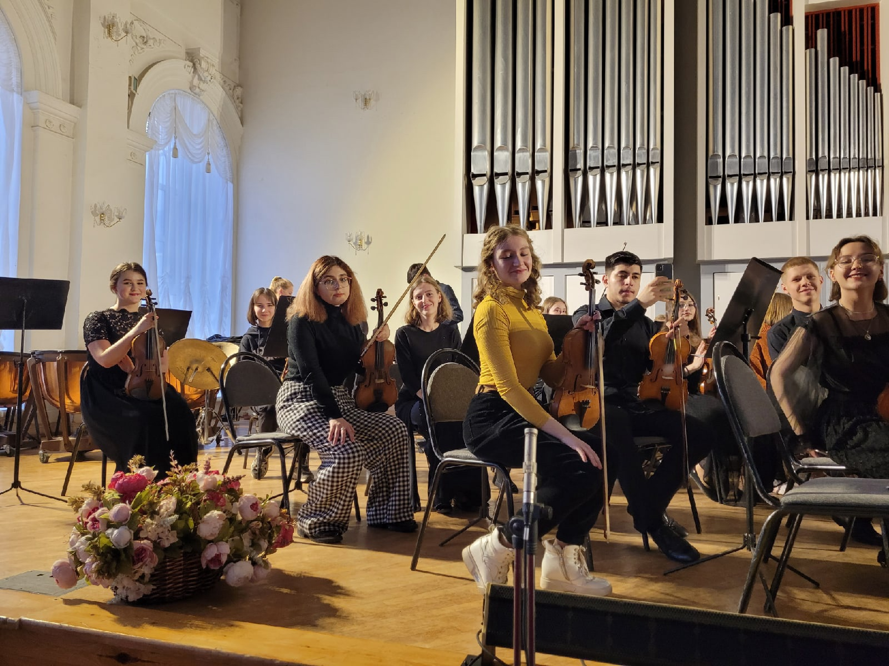

## My week

_ _ _

This week was the birthday of a dear friend of mine. Unfortunately, now I am not in my hometown, but this did not stop me from congratulating him and finding out how he is feeling.

Also this week there was a graduation concert at my art college. String and wind instruments performed. I watched the broadcast online and really enjoyed it.

